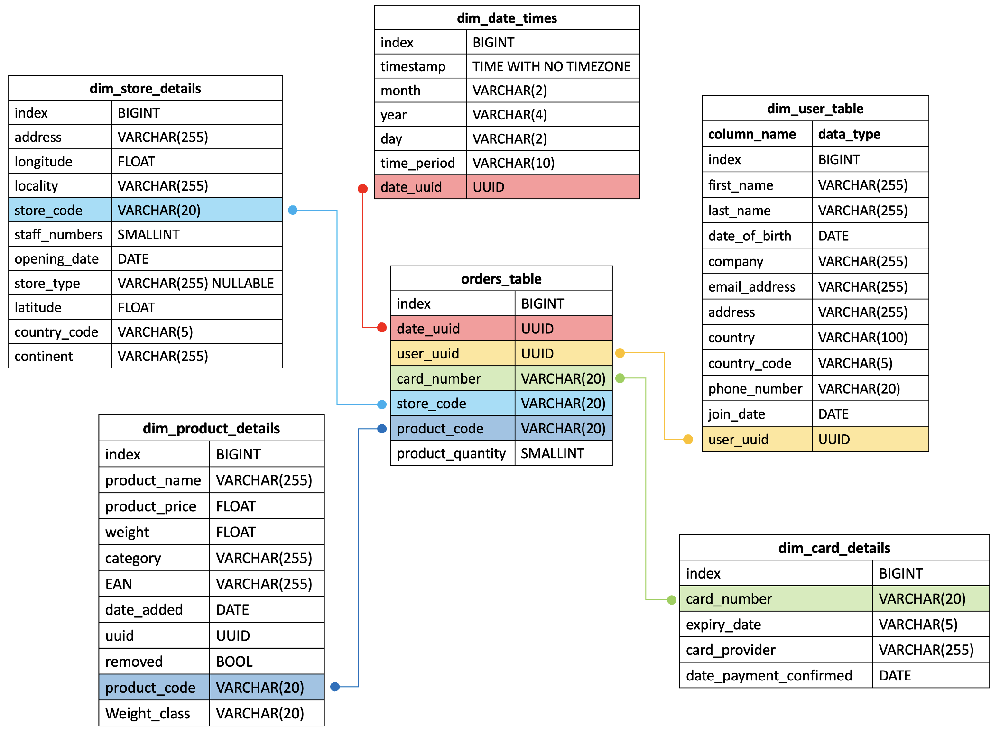

# Multinational Retail Data Centralisation Poject 

## Overview
The Multinational Retail Data Centralisation project aims to centralise and consolidate retail-related data from multiple sources into a single database for efficient management and analysis. This repository contains the scripts and utilities to extract, clean, and upload data from various retail-related sources into a database.

## Installation

### 1. Clone the repository:
```
git clone https://github.com/kdragoi/multinational-retail-data-centralisation.git
```
### 2. Install the required Python packages:
```
pip install -r environment_requirements.txt
```
Required packages can be accessed via the environment_requirements.txt document located in the repository.

## File structure

<pre>
<b>multinational-retail-data-centralisation/</b>
├─ <b>data_extraction_and_cleaning/</b>
│  ├─ <b>data_extraction.py</b>
│  │  <i>Code which defines Class DataExtractor for extracting 
│  │  data from various sources using various methods</i>
│  ├─ <b>data_cleaning.py</b>
│  │  <i>Code which defines Class DataCleaning for cleaning 
│  │  data from various sources using pandas dataframes</i>
│  ├─ <b>data_utils.py</b>
│  │  <i>Code which defines Class DataConnector for connecting 
│  │  to and uploading to a given database</i>
│  └─ <b>main.py</b>
│     <i>Uses code from data_extraction.py, data_cleaning.py and 
│     data_utils.py to extract, clean and upload data to a database</i>
├─ <b>database_schema/</b>
│  ├─ <b>database_schema.png</b>
│  │  <i>High level image of the final database schema</i>
│  ├─ <b>dim_card_details_datatype_correction.sql</b>
│  │  <i>SQL code to correct datatypes for dim_card_details table</i>
│  ├─ <b>dim_store_details_datatype_correction.sql</b>
│  │  <i>SQL code to correct datatypes for dim_store_details table</i>
│  ├─ <b>dim_users_datatype_correction.sql</b>
│  │  <i>SQL code to correct datatypes for dim_users table</i>
│  ├─ <b>orders_table_datatype_correction.sql</b>
│  │  <i>SQL code to correct datatypes for orders table</i>
│  ├─ <b>dim_products_adding_weight_class.sql</b>
│  │  <i>SQL code to add a weight_class column to the
│  │  dim_products table</i>
│  ├─ <b>dim_products_datatype_correction.sql</b>
│  │  <i>SQL code to correct datatypes for dim_products table</i>
│  └─ <b>sales_db_relationships.sql</b>
│     <i>SQL code to define primary and foreign keys and 
│     joins tables to create final schema</i>
├─ <b>queries/</b>
│  └─ <i>Contains a SQL file for each query and an outputs folder
│     containing the screenshots used within the README file </i>
├─ <b>environment_requirements.txt</b>
│  <i>Environment requirements for the project environment</i>
└─ <b>README.md</b>
</pre>

<br/>

## Usage Workflow

### Step 1:
The necessary database credentials were set up by creating the `db_creds.yaml` and `local_db_creds.yaml` files.

### Step 2:
The `data_utils.py`, `data_extraction.py`, `data_cleaning.py` and `main.py` scripts were executed according to our data extraction and cleaning needs:
    - `upload_dim_users()`: Extracts, cleans, and uploads user data to the database
    - `upload_dim_card_details()`: Extracts, cleans, and uploads card details data to the database
    - `upload_dim_store_details()`: Extracts, cleans, and uploads store information data to the database
    - `upload_dim_products()`: Extracts, cleans, and uploads product data to the database
    - `upload_orders_table()`: Extracts, cleans, and uploads orders data to the database
    - `upload_dim_date_times()`: Extracts, cleans, and uploads date/time details data to the database

### Step 3:
Within pgAdmin4 postgres the scripts in the `database_schema` folder were executed in order:
    1. `dim_users_datatype_correction.sql`
    1. `dim__card_details_datatype_correction.sql`
    1. `dim_store_details_datatype_correction.sql`
    1. `dim_products_adding_weight_class.sql`
    1. `dim_products_datatype_correction.sql`
    1. `dim_date_times_datatype_correction.sql`
    1. `orders_table_datatype_correction.sql`
    1. `sales_db_relationships.sql`

to correct the datatypes of each column in each table and then create the starbased schemas seen below:



### Step 4:
The scripts in the `queries` folder were executed:

### Query 1: How many stores does the business have and in which countries?


### Query 2: Which locations currently have the most stores?


### Query 3: Which months produced the largest amount of sales?


### Query 4: How many sales are coming from online?


### Query 5: What percentage of sales come through each type of store?


### Query 6: Which month in each year produced the highest cost of sales?


### Query 7: What is our staff headcount?


### Query 8: Which German store type is selling the most?


<br/>

## Limitations and Improvements

Since completing the project there are are a few limitations and improvements which I believe would mitiage some problems I had in the later stages as well as improve the overall performace. 

When adding the foreign key constraints to the `orders_table`, I came across missing data in the `dim` tables. I therefore went back to the raw data and checked if the data ever existed in the raw tables before determining wether to delete them or not in order for the foreign key assignment to work. Where the data still existed in the raw data tables, I believe that either my data cleaning was too thorough and therefore resulted in significant data loss and/or when validating certain data, there was an unforseen error in the program leading to losing data which was infact valid.

In order to reduce this data loss, I believe that it would be more beneficial to link the tables in a different way in order to allow for this mismatching.

One issue that I could not resolve was when checking the mismatching data prior to creating the foreign keys, all of the user_uuids in the orders_table were mismatched and I also did not find that they existed in the raw data table. Therefore, as none of the query tasks relied on the user data, I refrained from adding the user_uuid foreign key to the users_table.


